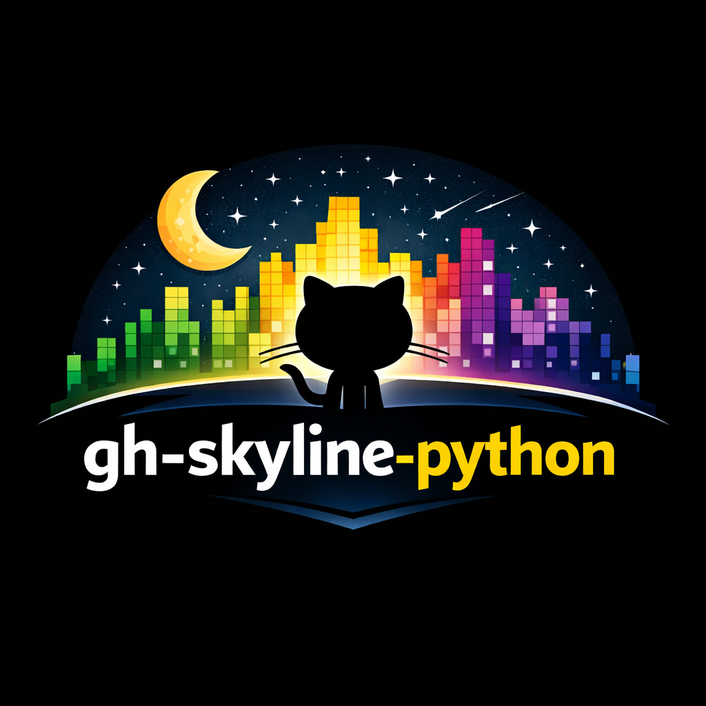

^^^^^^^^

`gh-skyline-python` is a Python-only tool for generating GitHub skyline STL models from contribution history.

MVP capabilities include:

- Contribution fetch via ``gh`` auth or token-based HTTPS fallback
- ASCII preview generation
- STL skyline generation (base, columns, and raster-based text/logo embossing)

Quick Start
-----------

.. code-block:: shell

   # install from PyPI
   pip install gh-skyline-python

   # generate skyline for a user/year via CLI
   skyline --year 2024 --user JLSteenwyk --output my-skyline

Documentation Structure
-----------------------

.. toctree::
   :maxdepth: 3

   about/index
   getting_started/index
   usage/index
   development/index
   release/index
